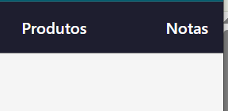
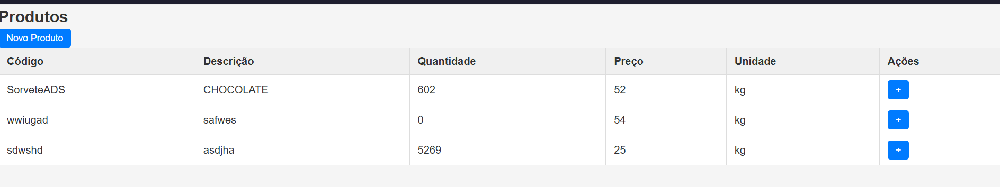
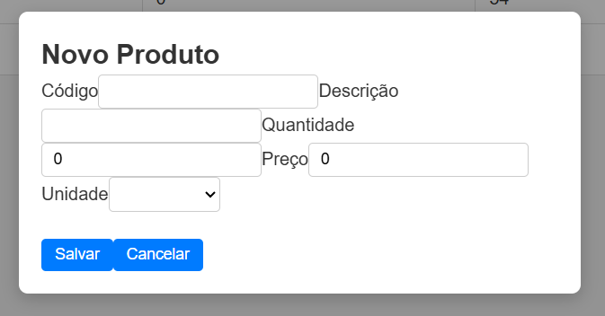
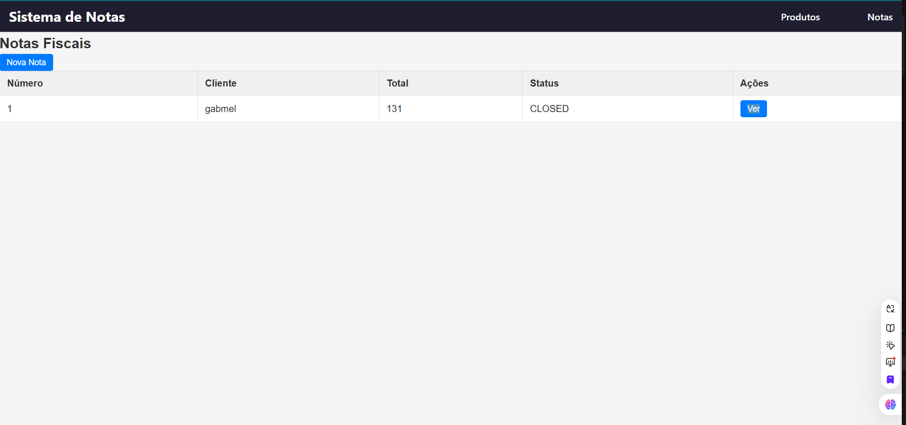
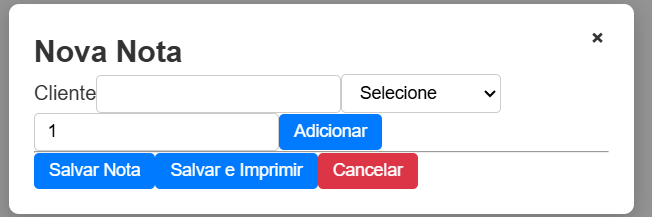
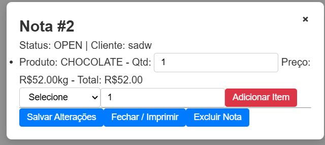
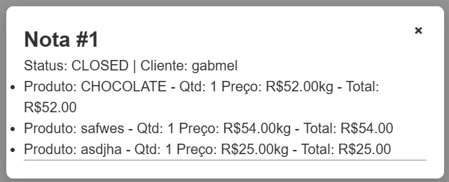

# Korp_Teste_Gabriel_De_Melo_Lima
Este repositório é responsável por entregar minha solução para o problema descrito no desafio: `Projeto técnico: Sistema de emissão de Notas Fiscais`

[video de apresentação](https://youtu.be/fqCtEtv21tU)

# Indices:
* [Escopo do problema](#escopo-do-problema)
* [Solução do problema](#solução-do-problema) 
* [Ferramentas usadas](#ferramentas-usadas)
    - [Frameworks](#frameworks)
    - [Bibliotecas](#Bibliotecas)
* [Detalhamento Técnico]
(#comentários-sobre-a-implementação-do-projeto)
* [Build para rodar](#)

# Escopo do problema

## Funcionalidades a serem desenvolvidas

### Cadastro de Produto

Campos obrigatórios:

* Código
* Descrição (nome do produto)
* Saldo (quantidade disponível em estoque)

**Resultado esperado:** permitir que um produto seja previamente cadastrado para posterior utilização em notas fiscais.

### Cadastro de Notas Fiscais

Campos obrigatórios:

* Numeração sequencial
* Status: *Aberta* ou *Fechada*
* Inclusão de múltiplos produtos com respectivas quantidades

**Resultado esperado:** permitir a criação de uma nota fiscal com numeração sequencial e status inicial *Aberta*.

### Impressão de Notas Fiscais

* Botão de impressão visível e intuitivo em tela.

Resultado esperado:

- Ao clicar no botão, exibir indicador de processamento;
- Após finalização, atualizar o status da nota para *Fechada*;
- Não permitir a impressão de notas com status diferente de *Aberta*;
- Atualizar o saldo dos produtos conforme a quantidade utilizada na nota.

      Exemplo: saldo anterior = 10; nota utiliza 2 unidades -> novo saldo = 8.

## Requisitos obrigatórios

* Arquitetura de Microsserviços:
Estruturar o sistema com no mínimo dois microsserviços:
   - Serviço de Estoque – controle de produtos e saldos;
   -  Serviço de Faturamento – gestão de notas fiscais.
* Tratamento de Falhas:
Implementar um cenário em que um dos microsserviços falha.
O sistema deve ser capaz de se recuperar da falha e fornecer
feedback apropriado ao usuário sobre o erro.
* Conexão Real com banco de dados:
É esperado que os cadastros sejam persistidos fisicamente em um banco
de dados de sua escolha.

## Requisitos opcionais
O candidato poderá, a seu critério, implementar também:
* Tratamento de Concorrência:

    Cenário: produto com saldo 1 sendo utilizado simultaneamente por duas notas.

    
* Uso de Inteligência Artificial:

    Implementar alguma funcionalidade do sistema que utilize IA.


* Implementação de Idempotência:

    Garantir que operações repetidas não causem efeitos colaterais indesejados.


# Solução do problema

Para atender as requisições optei por docker que é fácil testar falhas sistemicas sem a preocupação de criar uma corrupção de banco. 

Existencia de 3 entidades: Produtos, Notas e uma relacional que foi muito chamada de InvoiceItem por mim.

Cada um dos dois serviços são indeoendentes se não pelo banco a quem eles dependem. no meu caso postegres. 

Apliquei controle de concorrencia validadando ativamente estoque e retrocedendo ações que deixariam o estoque negativo.

Apliquei controle de idempotencia em Notas fiscais usando uma coluna de chaves unicas auto-geradas. Não foi preciso tratar produtos por necessitar de codigo único :/)

A regra do banco foi fortemente cuidada nos diretorios Data de cada microcerviços e as rodas no diretorio Controlers.

Apesar de ter dois serviços semi-distintos juntei ambas as rotas em gat way para facilitar minha comunicação com o front-end.

da parte visual:

instanciei duas paginas:


a pagina produtos lista os produtos e tem botões para adiçao de mercadoria já cadastradas.



ela também tem um botão que abre um modal para cadastro de produtos.



E a pagina de notas que permite:


criar notas.



cada uma dessas notas tem uma opção de visualização.

se ela está aberta pode ser editada



e visualizar notas fechadas \\\\(•-•)//



Os erros foram tratados retornando os devidos codigos e acontecidos para o terminal ou para notificações da tela :\)


# Como buildar:

1. Instale e/ou inicie o docker
2. no repositório: `docker-compose up --build`
3. no diretório cd ./frontend:
    - `npm install`
    - `npm start`
```
Router:
    - inventory: http://localhost:5001,
    - billing: http://localhost:5002,
    - gatway: http://localhost:5000,
    - frontend: http://localhost:4200.
```


# Ferramentas usadas

* **`angular.js`** 
    - Sass (SCSS)
    - GitHub Copilot
    - angular/cors para reatividade
* **`node.js`**

* Docker-modules


## Bibliotecas

### Node.js
- express
- http-proxy-middleware
- cors

## C#
- Microsoft.EntityFrameworkCore
- Npgsql.EntityFrameworkCore.PostgreSQL
- Microsoft.EntityFrameworkCore.Tools


- dotnet-ef

# Comentários sobre a Implementação do Projeto

### Ciclos de vida do Angular utilizados
- Foram utilizados principalmente **`ngOnInit`** para inicialização de dados em componentes como listas de produtos e invoices.
- Possivelmente **`ngOnChanges`** foi usado para reagir a mudanças em `@Input()` nos componentes de detalhes.
- **`ngOnDestroy`** poderia ser usado para limpar subscriptions de observables, evitando memory leaks.

### Uso da biblioteca RxJS
- Sim, foi feito uso do **RxJS**:
  - Nos serviços Angular (`ProductService`, `InvoiceService`) com métodos como `http.get()` que retornam **Observables**.
  - Uso de `.subscribe()` para consumir dados do backend de forma reativa.
  - Possível uso de operadores como `map`, `filter` ou `tap` para manipulação de fluxos de dados (dependendo do serviço).

### Outras bibliotecas utilizadas
- **Humanizer** no C#: para formatação amigável de datas ou números.
- **Entity Framework Core** no C#: para ORM e acesso a bancos de dados relacionais.
- **Microsoft.AspNetCore.Mvc**: para construção de APIs REST.

### Componentes visuais e bibliotecas
- Angular padrão com **Angular Router** para navegação (`routerLink`).
- CSS/SCSS customizado para navegação, botões e layout.
- Não há menção de frameworks visuais externos como Material ou Bootstrap, mas poderiam ser facilmente integrados.

### Gerenciamento de dependências no Golang
- Não aplicável, pois o backend é em **C#/.NET**.

### Frameworks utilizados no Golang ou C#
- **C#/.NET 8**:
  - **ASP.NET Core** para criação de APIs REST.
  - **Entity Framework Core** para acesso ao banco de dados e mapeamento ORM.

### Tratamento de erros e exceções no backend
- No **C#**, foram utilizados:
  - Retornos **`BadRequest()`** para validação de entradas inválidas.
  - Retornos **`NotFound()`** quando um recurso não existe.
  - Estrutura de `try/catch` poderia ser usada para capturar exceções inesperadas, embora o código apresentado use validação antes de salvar no banco.

### Uso de LINQ em C#
- Sim, LINQ foi utilizado para:
  - Verificar existência de registros:  
    ```csharp
    _context.Products.Any(p => p.Id == id);
    ```
  - Possível uso em consultas para filtragem ou projeção de dados no banco com **Entity Framework**.